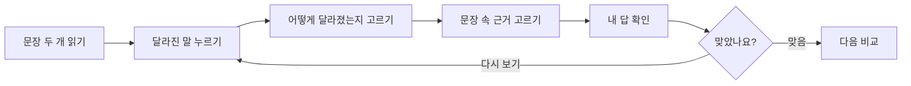

# 2026-08-16 풀이 안내·단계 강조 개선 계획

## 사용자 문제

초등학생 사용자가 현재 활동에서 `무엇을 먼저 고르고`, `왜 그 답을 고르는지`, `다음 버튼을 언제 눌러야 하는지`를 한 번에 이해하기 어렵습니다. 기존 화면에 1·2·3 순서가 있지만, 각 단계에서 실제로 해야 할 행동과 생각 방법을 보여 주는 예시가 부족합니다.

## 개선 목표

1. 활동을 시작하기 전 “이렇게 풀어요”를 짧고 구체적인 말과 예시로 보여 줍니다.
2. 비교 화면에서 각 단계의 목적, 선택 기준, 다음 행동을 바로 확인하게 합니다.
3. 현재 단계에서 꼭 눌러야 하는 버튼에는 `gi-pulse` 시각 효과를 적용하되, 비활성 버튼은 깜빡이지 않게 합니다.
4. 오답·미완성 상태에서도 다음 행동을 한 문장으로 안내합니다.
5. 작은 화면과 `prefers-reduced-motion` 환경에서도 읽기·조작이 유지되게 합니다.

## 핵심 흐름

## 구현 범위

### 1. 공통 풀이 안내 컴포넌트

- `app/components/SolutionGuide.tsx`를 새로 만듭니다.
- `읽기 → 달라진 말 → 변화 종류 → 근거 → 답 확인` 5단계를 카드로 표시합니다.
- “예: ‘비가 오면’이 사라졌다면 ‘조건이 빠짐’”처럼 구체적인 쉬운 예시를 제공합니다.
- `aria-label`과 제목 구조를 넣고, 모바일에서는 한 줄씩 쌓습니다.

### 2. 튜토리얼과 비교 화면 개선

- 튜토리얼 첫 화면에 풀이 안내를 넣고, 각 단계 설명을 현재 화면 위에 유지합니다.
- 비교 화면에 현재 단계용 안내 문장을 추가합니다.
- 선택 전에는 “문장 속 낱말을 먼저 눌러 보세요.”, 선택 후에는 “이제 변화 종류를 골라 보세요.”처럼 다음 행동을 바꿔 표시합니다.
- 오답 피드백에 `다시 할 일`을 덧붙여 한 번에 하나의 행동만 제시합니다.

### 3. 중요 버튼 주목 효과

- `app/styles/components.css`에 `gi-pulse` 키프레임과 아우라 효과를 추가합니다.
- 시작, 답 확인, 다음 단계, 전체 변화 확인, 활동 마치기, 다음 사건 버튼 중 현재 활성화된 핵심 버튼에만 적용합니다.
- `prefers-reduced-motion: reduce`에서는 애니메이션을 제거하고 색·테두리·텍스트로 동일한 중요도를 전달합니다.

### 4. 문장 난이도 조정

- 기존 전문적인 표현을 학생용 표현으로 보완합니다.
- `뜻이 바뀜`에는 “누가/언제/어디서/몇 개 같은 중요한 정보가 달라짐” 설명을 함께 노출합니다.
- `근거`라는 말에는 “문장에서 이유가 되는 말”을 붙입니다.

### 5. 기록과 검증

- 업데이트 내역에 2026-08-16 개선 내용을 추가합니다.
- 기존 단위·렌더링·E2E 테스트를 실행합니다.
- 390px 모바일과 reduced-motion 상태에서 핵심 버튼이 보이고, 비활성 다음 버튼이 강조되지 않는지 확인합니다.

## 완료 기준

- 튜토리얼과 실제 비교 화면에서 풀이 방법이 각각 보입니다.
- 사용자가 현재 화면에서 다음에 할 행동을 한 문장으로 알 수 있습니다.
- 핵심 버튼은 활성 상태에서 시각적으로 눈에 띄고, 비활성 상태에서는 펄스하지 않습니다.
- 기존 테스트가 모두 통과합니다.
- 계획과 구현 내역이 이 문서 및 업데이트 내역에 남습니다.

## 구현·검증 결과

- `SolutionGuide` 공통 컴포넌트를 추가해 튜토리얼과 문장 비교 화면에 5단계 풀이 방법을 표시했습니다.
- 현재 선택 상태에 따라 “지금 할 일” 문장이 바뀌도록 해, 한 번에 하나의 행동만 안내합니다.
- 시작·사건 비교·답 확인·다음 단계·활동 마치기·다음 사건 버튼에 활성 상태용 `gi-pulse` 효과를 적용했습니다.
- 비활성 다음 버튼은 펄스하지 않으며, reduced-motion 환경에서는 애니메이션 대신 고정 외곽선으로 중요도를 표시합니다.
- 업데이트 내역에 2026-08-16 개선 내용을 기록했습니다.

검증 결과:

| 항목 | 결과 |
| --- | --- |
| `npm run typecheck` | 통과 |
| `npm run lint` | 통과 |
| `npm test` | 30개 통과 |
| `npm run test:e2e -- --reporter=line` | 15개 통과 |
| 모바일 390px·reduced-motion | E2E에서 확인 |
